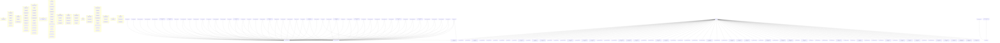

# Dependency Graph

```mermaid
graph TD
  subgraph agents
    agents_bee-factory_js[bee-factory]
    agents_federation-manager_js[federation-manager]
    agents_hive-coordinator_js[hive-coordinator]
  end
  subgraph auth
    auth_auth-gateway_js[auth-gateway]
  end
  subgraph config
    config_environment-config_js[environment-config]
    config_heady-config_js[heady-config]
    config_pipeline-canonical_js[pipeline-canonical]
  end
  subgraph core
    core_auto-success-engine_js[auto-success-engine]
    core_budget-tracker_js[budget-tracker]
    core_council-mode_js[council-mode]
    core_evolution-engine_js[evolution-engine]
    core_heady-autobiographer_js[heady-autobiographer]
    core_heady-brains_js[heady-brains]
    core_heady-lens_js[heady-lens]
    core_heady-manager-kernel_js[heady-manager-kernel]
    core_persona-router_js[persona-router]
    core_wisdom-store_js[wisdom-store]
  end
  subgraph deploy
    deploy_cloud-run-deployer_js[cloud-run-deployer]
    deploy_cloudflare-deployer_js[cloudflare-deployer]
    deploy_universal-container_js[universal-container]
  end
  subgraph index.js
    index_js[index]
  end
  subgraph memory
    memory_embedding-pipeline_js[embedding-pipeline]
    memory_memory-cache_js[memory-cache]
    memory_projection-engine_js[projection-engine]
    memory_vector-store_js[vector-store]
  end
  subgraph monitoring
    monitoring_drift-detector_js[drift-detector]
    monitoring_health-probe-system_js[health-probe-system]
    monitoring_incident-responder_js[incident-responder]
    monitoring_telemetry-collector_js[telemetry-collector]
  end
  subgraph orchestration
    orchestration_arena-mode-enhanced_js[arena-mode-enhanced]
    orchestration_hcfp-runner_js[hcfp-runner]
    orchestration_socratic-loop_js[socratic-loop]
    orchestration_swarm-definitions_js[swarm-definitions]
  end
  subgraph scaling
    scaling_api-contracts_js[api-contracts]
    scaling_auto-scaler_js[auto-scaler]
    scaling_cloud-run-optimizer_js[cloud-run-optimizer]
    scaling_cqrs-manager_js[cqrs-manager]
    scaling_dead-letter-queue_js[dead-letter-queue]
    scaling_error-codes_js[error-codes]
    scaling_event-bus-nats_js[event-bus-nats]
    scaling_feature-flags_js[feature-flags]
    scaling_grpc-bridge_js[grpc-bridge]
    scaling_heady-services_proto_js[heady-services.proto]
    scaling_hnsw-tuner_js[hnsw-tuner]
    scaling_jit-loader_js[jit-loader]
    scaling_pgbouncer-pool_js[pgbouncer-pool]
    scaling_resource-allocator_js[resource-allocator]
    scaling_saga-coordinator_js[saga-coordinator]
  end
  subgraph scripts
    scripts_generate-dependency-graph_js[generate-dependency-graph]
  end
  subgraph security
    security_autonomy-guardrails_js[autonomy-guardrails]
    security_cors-strict_js[cors-strict]
    security_crypto-audit-trail_js[crypto-audit-trail]
    security_csp-middleware_js[csp-middleware]
    security_owasp-ai-defense_js[owasp-ai-defense]
    security_prompt-injection-guard_js[prompt-injection-guard]
    security_rbac-engine_js[rbac-engine]
    security_request-signer_js[request-signer]
    security_sbom-generator_js[sbom-generator]
    security_secret-manager_js[secret-manager]
    security_structured-logger_js[structured-logger]
    security_websocket-auth_js[websocket-auth]
  end
  subgraph services
    services_analytics-service_js[analytics-service]
    services_asset-pipeline_js[asset-pipeline]
    services_auth-session-server_js[auth-session-server]
    services_billing-service_js[billing-service]
    services_migration-service_js[migration-service]
    services_notification-service_js[notification-service]
    services_scheduler-service_js[scheduler-service]
    services_search-service_js[search-service]
    services_service-mesh_js[service-mesh]
    services_service-registry_js[service-registry]
  end
  subgraph shared
    shared_csl-engine-v2_js[csl-engine-v2]
    shared_phi-math-v2_js[phi-math-v2]
    shared_sacred-geometry-v2_js[sacred-geometry-v2]
  end
  subgraph tests
    tests_compliance_test_js[compliance.test]
    tests_integration_test_js[integration.test]
    tests_scaling_test_js[scaling.test]
    tests_security_test_js[security.test]
    tests_services_test_js[services.test]
    tests_shared_test_js[shared.test]
  end
  subgraph websites
    websites_website-registry_js[website-registry]
  end
  auth_auth-gateway --> ___shared_phi-math-v2
  core_auto-success-engine --> ___shared_phi-math-v2
  core_auto-success-engine --> ___shared_csl-engine-v2
  core_budget-tracker --> ___shared_phi-math-v2
  core_council-mode --> ___shared_phi-math-v2
  core_council-mode --> ___shared_csl-engine-v2
  core_evolution-engine --> ___shared_phi-math-v2
  core_evolution-engine --> ___shared_csl-engine-v2
  core_heady-autobiographer --> ___shared_phi-math-v2
  core_heady-autobiographer --> ___shared_csl-engine-v2
  core_heady-brains --> ___shared_phi-math-v2
  core_heady-brains --> ___shared_csl-engine-v2
  core_heady-lens --> ___shared_phi-math-v2
  core_heady-lens --> ___shared_sacred-geometry-v2
  core_heady-manager-kernel --> ___shared_phi-math-v2
  core_heady-manager-kernel --> ___shared_csl-engine-v2
  core_persona-router --> ___shared_phi-math-v2
  core_persona-router --> ___shared_csl-engine-v2
  core_wisdom-store --> ___shared_phi-math-v2
  core_wisdom-store --> ___shared_csl-engine-v2
  deploy_cloud-run-deployer --> ___shared_phi-math-v2
  deploy_cloudflare-deployer --> ___shared_phi-math-v2
  deploy_universal-container --> ___shared_phi-math-v2
  index --> __shared_phi-math-v2
  index --> __shared_csl-engine-v2
  index --> __shared_sacred-geometry-v2
  index --> __core_evolution-engine
  index --> __core_persona-router
  index --> __core_wisdom-store
  index --> __core_budget-tracker
  index --> __core_heady-lens
  index --> __core_council-mode
  index --> __core_auto-success-engine
  index --> __core_heady-brains
  index --> __core_heady-autobiographer
  index --> __core_heady-manager-kernel
  index --> __auth_auth-gateway
  index --> __agents_bee-factory
  index --> __agents_hive-coordinator
  index --> __agents_federation-manager
  index --> __memory_vector-store
  index --> __memory_embedding-pipeline
  index --> __memory_projection-engine
  index --> __memory_memory-cache
  index --> __services_service-registry
  index --> __services_service-mesh
  index --> __services_auth-session-server
  index --> __services_notification-service
  index --> __services_analytics-service
  index --> __services_billing-service
  index --> __services_search-service
  index --> __services_scheduler-service
  index --> __services_migration-service
  index --> __services_asset-pipeline
  index --> __security_rbac-engine
  index --> __security_crypto-audit-trail
  index --> __security_secret-manager
  index --> __security_csp-middleware
  index --> __security_prompt-injection-guard
  index --> __security_websocket-auth
  index --> __security_sbom-generator
  index --> __security_autonomy-guardrails
  index --> __security_owasp-ai-defense
  index --> __security_structured-logger
  index --> __security_request-signer
  index --> __security_cors-strict
  index --> __monitoring_health-probe-system
  index --> __monitoring_drift-detector
  index --> __monitoring_telemetry-collector
  index --> __monitoring_incident-responder
  index --> __scaling_auto-scaler
  index --> __scaling_resource-allocator
  index --> __scaling_jit-loader
  index --> __scaling_cqrs-manager
  index --> __scaling_saga-coordinator
  index --> __scaling_feature-flags
  index --> __scaling_dead-letter-queue
  index --> __scaling_api-contracts
  index --> __scaling_error-codes
  index --> __scaling_heady-services_proto
  index --> __scaling_event-bus-nats
  index --> __scaling_pgbouncer-pool
  index --> __scaling_hnsw-tuner
  index --> __scaling_cloud-run-optimizer
  index --> __scaling_grpc-bridge
  index --> __deploy_universal-container
  index --> __deploy_cloud-run-deployer
  index --> __deploy_cloudflare-deployer
  index --> __config_heady-config
  index --> __config_pipeline-canonical
  index --> __config_environment-config
  index --> __websites_website-registry
  index --> __orchestration_hcfp-runner
  index --> __orchestration_arena-mode-enhanced
  index --> __orchestration_swarm-definitions
  index --> __orchestration_socratic-loop
  monitoring_drift-detector --> ___shared_phi-math-v2
  monitoring_drift-detector --> ___shared_csl-engine-v2
  monitoring_health-probe-system --> ___shared_phi-math-v2
  monitoring_incident-responder --> ___shared_phi-math-v2
  monitoring_incident-responder --> ___shared_csl-engine-v2
  monitoring_telemetry-collector --> ___shared_phi-math-v2
  scaling_api-contracts --> ___shared_phi-math-v2
  scaling_api-contracts --> ___shared_csl-engine-v2
  scaling_auto-scaler --> ___shared_phi-math-v2
  scaling_cqrs-manager --> ___shared_phi-math-v2
  scaling_cqrs-manager --> ___shared_csl-engine-v2
  scaling_dead-letter-queue --> ___shared_phi-math-v2
  scaling_dead-letter-queue --> ___shared_csl-engine-v2
  scaling_error-codes --> ___shared_phi-math-v2
  scaling_error-codes --> ___shared_csl-engine-v2
  scaling_feature-flags --> ___shared_phi-math-v2
  scaling_feature-flags --> ___shared_csl-engine-v2
  scaling_heady-services_proto --> ___shared_phi-math-v2
  scaling_heady-services_proto --> ___shared_csl-engine-v2
  scaling_jit-loader --> ___shared_phi-math-v2
  scaling_resource-allocator --> ___shared_phi-math-v2
  scaling_saga-coordinator --> ___shared_phi-math-v2
  scaling_saga-coordinator --> ___shared_csl-engine-v2
  security_autonomy-guardrails --> ___shared_phi-math-v2
  security_autonomy-guardrails --> ___shared_csl-engine-v2
  security_crypto-audit-trail --> ___shared_phi-math-v2
  security_csp-middleware --> ___shared_phi-math-v2
  security_csp-middleware --> ___shared_csl-engine-v2
  security_prompt-injection-guard --> ___shared_phi-math-v2
  security_prompt-injection-guard --> ___shared_csl-engine-v2
  security_rbac-engine --> ___shared_phi-math-v2
  security_rbac-engine --> ___shared_csl-engine-v2
  security_sbom-generator --> ___shared_phi-math-v2
  security_sbom-generator --> ___shared_csl-engine-v2
  security_secret-manager --> ___shared_phi-math-v2
  security_websocket-auth --> ___shared_phi-math-v2
  security_websocket-auth --> ___shared_csl-engine-v2
  services_analytics-service --> ___shared_phi-math-v2
  services_analytics-service --> ___shared_csl-engine-v2
  services_asset-pipeline --> ___shared_phi-math-v2
  services_asset-pipeline --> ___shared_csl-engine-v2
  services_auth-session-server --> ___shared_phi-math-v2
  services_auth-session-server --> ___shared_csl-engine-v2
  services_billing-service --> ___shared_phi-math-v2
  services_billing-service --> ___shared_csl-engine-v2
  services_migration-service --> ___shared_phi-math-v2
  services_migration-service --> ___shared_csl-engine-v2
  services_notification-service --> ___shared_phi-math-v2
  services_notification-service --> ___shared_csl-engine-v2
  services_scheduler-service --> ___shared_phi-math-v2
  services_scheduler-service --> ___shared_csl-engine-v2
  services_search-service --> ___shared_phi-math-v2
  services_search-service --> ___shared_csl-engine-v2
  services_service-mesh --> ___shared_phi-math-v2
  services_service-registry --> ___shared_phi-math-v2
  services_service-registry --> ___shared_csl-engine-v2
  shared_csl-engine-v2 --> __phi-math-v2
  shared_sacred-geometry-v2 --> __phi-math-v2
  tests_integration_test --> ___shared_phi-math-v2
  tests_integration_test --> ___shared_csl-engine-v2
  tests_services_test --> ___shared_phi-math-v2
  tests_shared_test --> ___shared_phi-math-v2
  tests_shared_test --> ___shared_csl-engine-v2
  tests_shared_test --> ___shared_sacred-geometry-v2
```