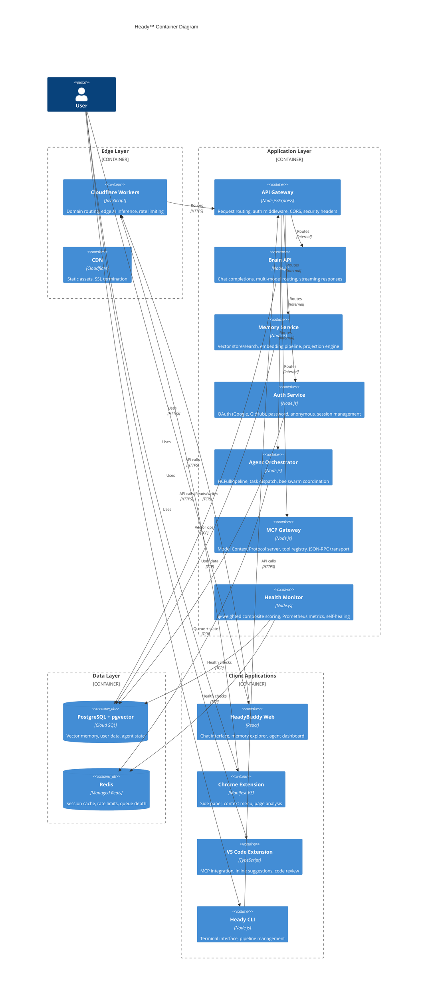

# C4 Container Diagram — Heady™ Platform

## Container View

## Container Inventory

| Container | Technology | Port | Responsibility |
|-----------|-----------|------|---------------|
| **Cloudflare Workers** | JavaScript (V8) | 443 | Domain routing for 16 domains, edge AI inference, rate limiting, geo-routing |
| **API Gateway** | Node.js + Express | 3301 | Central request router, auth middleware, CORS, security headers, graceful shutdown |
| **Brain API** | Node.js | Internal | Multi-model routing (Claude, GPT-4o, Gemini, Groq), chat completions, streaming |
| **Memory Service** | Node.js | Internal | pgvector CRUD, embedding generation, semantic search, projection engine |
| **Auth Service** | Node.js | 3847 | OAuth2 (Google, GitHub), password auth, anonymous auth, session cookies |
| **Agent Orchestrator** | Node.js | Internal | 21-stage HCFullPipeline, bee swarm dispatch, task queue management |
| **MCP Gateway** | Node.js | Internal | Tool registry, JSON-RPC transport, SSE streaming, IDE bridge |
| **Health Monitor** | Node.js | Internal | φ-weighted composite scoring, Prometheus, K8s probes, self-healing |
| **PostgreSQL** | Cloud SQL 15 + pgvector | 5432 | Vector memory, application data, auth records |
| **Redis** | Managed Redis 7 | 6379 | Session cache, rate limit counters, queue state |

## Communication Patterns

1. **Edge → Origin**: Cloudflare Workers reverse-proxy to Cloud Run via HTTPS
2. **Internal routing**: Express sub-apps co-hosted in single Node.js process on Cloud Run
3. **Agent mesh**: mTLS 1.3 for inter-agent communication (when cert bundle present)
4. **WebSocket**: Voice relay via `wss://` upgrade on `/ws/voice/:sessionId`
5. **Event bus**: NATS JetStream for async event dispatch between services
