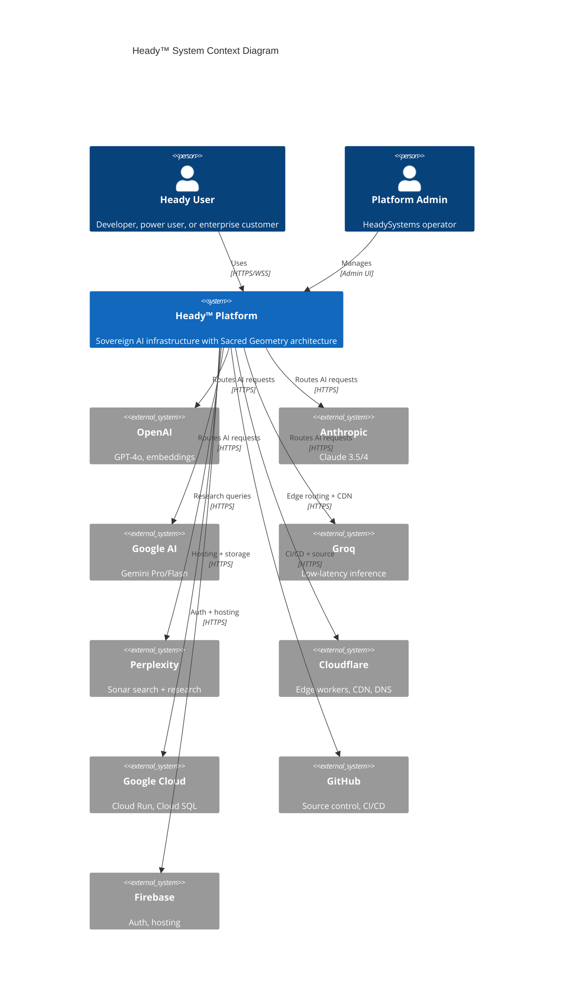

# C4 Context Diagram — Heady™ Platform

## System Context

The Heady™ platform is a sovereign AI infrastructure system that provides multi-model AI routing, persistent vector memory, agent orchestration, and cross-device companion capabilities.

## External Actors

| Actor | Description | Interaction |
|-------|-------------|-------------|
| **Heady User** | End user accessing the platform via web, Chrome extension, VS Code, desktop, or mobile | HTTPS + WebSocket |
| **Platform Admin** | HeadySystems team managing infrastructure and configuration | Admin UI + CLI |
| **AI Providers** | OpenAI, Anthropic, Google, Groq — multi-model routing targets | REST API |
| **Perplexity** | Deep research and web search with citations | REST API |
| **Cloudflare** | Edge compute, DNS, SSL termination, domain routing | Workers API |
| **Google Cloud** | Cloud Run (compute), Cloud SQL (PostgreSQL + pgvector) | GCP APIs |
| **GitHub** | Source control, CI/CD workflows, Copilot agents | REST + WebHook |
| **Firebase** | Authentication (OAuth, password, anonymous), static hosting | Firebase SDK |

## Key Boundaries

1. **Trust Boundary**: All external AI provider traffic is encrypted (TLS 1.3) and routed through the Heady gateway with circuit breakers and retry logic
2. **Data Boundary**: Vector memory (pgvector) never leaves the sovereign cloud — embeddings are generated server-side
3. **Auth Boundary**: OAuth tokens, API keys, and session cookies are scoped per-domain with `SameSite=Lax` and `HttpOnly` flags
