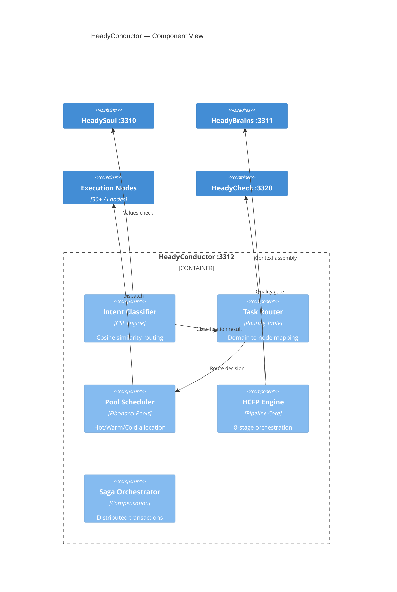

# C4 Component Diagram — HeadyConductor

```mermaid
C4Component
    title HeadyConductor — Component View

    Container_Boundary(conductor, "HeadyConductor :3312") {
        Component(classifier, "Intent Classifier", "CSL Engine", "Cosine similarity routing")
        Component(router, "Task Router", "Routing Table", "Domain to node mapping")
        Component(scheduler, "Pool Scheduler", "Fibonacci Pools", "Hot/Warm/Cold allocation")
        Component(pipeline, "HCFP Engine", "Pipeline Core", "8-stage orchestration")
        Component(saga, "Saga Orchestrator", "Compensation", "Distributed transactions")
    }

    Container(soul, "HeadySoul :3310")
    Container(brains, "HeadyBrains :3311")
    Container(nodes, "Execution Nodes", "30+ AI nodes")
    Container(check, "HeadyCheck :3320")

    Rel(classifier, router, "Classification result")
    Rel(router, scheduler, "Route decision")
    Rel(scheduler, nodes, "Dispatch")
    Rel(pipeline, brains, "Context assembly")
    Rel(pipeline, check, "Quality gate")
    Rel(classifier, soul, "Values check")
```

Threshold levels: CRITICAL (0.927), HIGH (0.882), MEDIUM (0.809), LOW (0.691), MINIMUM (0.500)
Pool ratios: Hot 34%, Warm 21%, Cold 13%, Reserve 8%
