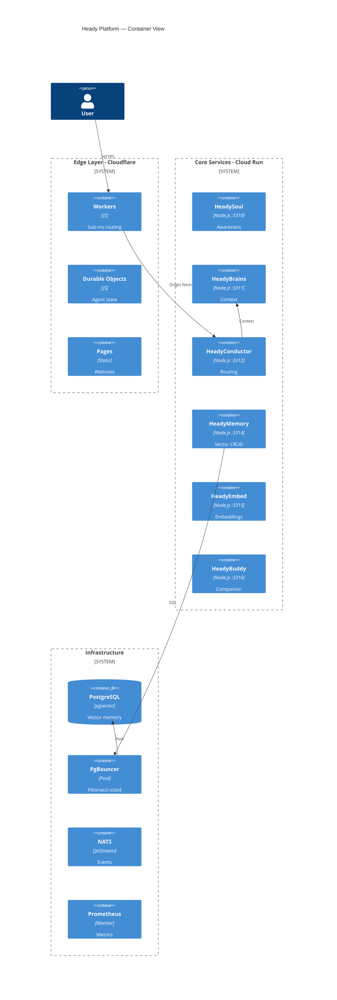

# C4 Container Diagram — Heady Platform

```mermaid
C4Container
    title Heady Platform — Container View

    Person(user, "User")

    System_Boundary(edge, "Edge Layer - Cloudflare") {
        Container(workers, "Workers", "JS", "Sub-ms routing")
        Container(durable, "Durable Objects", "JS", "Agent state")
        Container(pages, "Pages", "Static", "Websites")
    }

    System_Boundary(core, "Core Services - Cloud Run") {
        Container(soul, "HeadySoul", "Node.js :3310", "Awareness")
        Container(brains, "HeadyBrains", "Node.js :3311", "Context")
        Container(conductor, "HeadyConductor", "Node.js :3312", "Routing")
        Container(memory, "HeadyMemory", "Node.js :3314", "Vector CRUD")
        Container(embed, "HeadyEmbed", "Node.js :3315", "Embeddings")
        Container(buddy, "HeadyBuddy", "Node.js :3316", "Companion")
    }

    System_Boundary(infra, "Infrastructure") {
        ContainerDb(pg, "PostgreSQL", "pgvector", "Vector memory")
        Container(pgb, "PgBouncer", "Pool", "Fibonacci-sized")
        Container(nats, "NATS", "JetStream", "Events")
        Container(prom, "Prometheus", "Monitor", "Metrics")
    }

    Rel(user, workers, "HTTPS")
    Rel(workers, conductor, "Origin fetch")
    Rel(conductor, brains, "Context")
    Rel(memory, pgb, "SQL")
    Rel(pgb, pg, "Pool")
```
