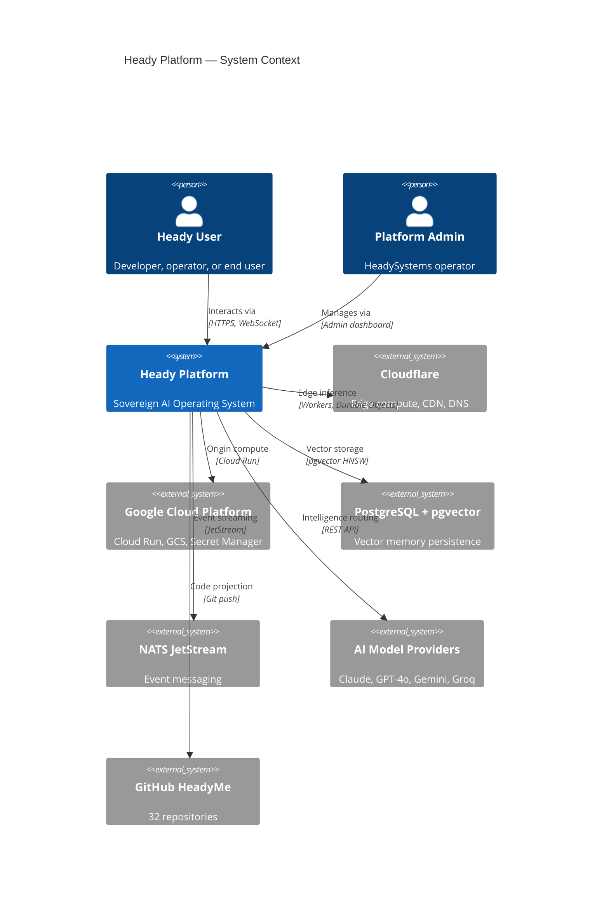

# C4 System Context Diagram — Heady Platform

```mermaid
C4Context
    title Heady Platform — System Context

    Person(user, "Heady User", "Developer, operator, or end user")
    Person(admin, "Platform Admin", "HeadySystems operator")

    System(heady, "Heady Platform", "Sovereign AI Operating System")

    System_Ext(cloudflare, "Cloudflare", "Edge compute, CDN, DNS")
    System_Ext(gcp, "Google Cloud Platform", "Cloud Run, GCS, Secret Manager")
    System_Ext(postgres, "PostgreSQL + pgvector", "Vector memory persistence")
    System_Ext(nats, "NATS JetStream", "Event messaging")
    System_Ext(models, "AI Model Providers", "Claude, GPT-4o, Gemini, Groq")
    System_Ext(github, "GitHub HeadyMe", "32 repositories")

    Rel(user, heady, "Interacts via", "HTTPS, WebSocket")
    Rel(admin, heady, "Manages via", "Admin dashboard")
    Rel(heady, cloudflare, "Edge inference", "Workers, Durable Objects")
    Rel(heady, gcp, "Origin compute", "Cloud Run")
    Rel(heady, postgres, "Vector storage", "pgvector HNSW")
    Rel(heady, nats, "Event streaming", "JetStream")
    Rel(heady, models, "Intelligence routing", "REST API")
    Rel(heady, github, "Code projection", "Git push")
```
