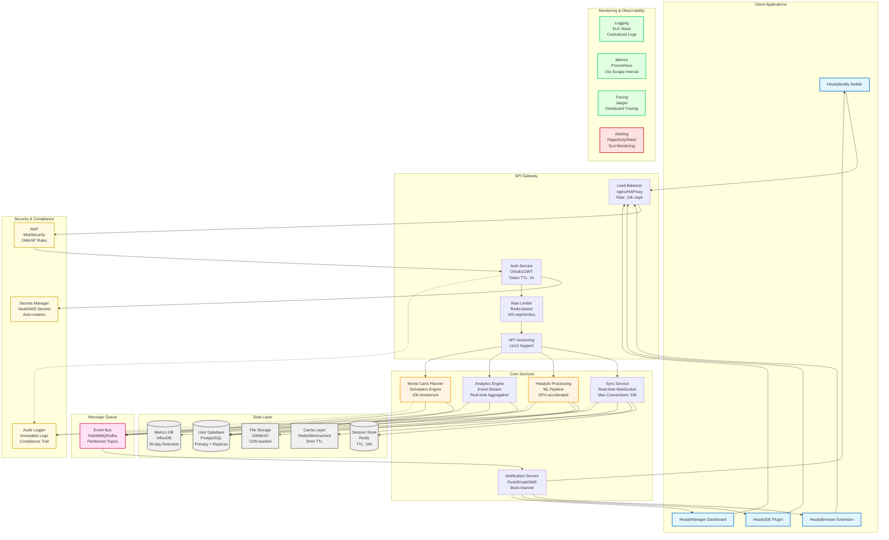

<!-- HEADY_BRAND:BEGIN
<!-- ╔══════════════════════════════════════════════════════════════════╗
<!-- ║  ██╗  ██╗███████╗ █████╗ ██████╗ ██╗   ██╗                     ║
<!-- ║  ██║  ██║██╔════╝██╔══██╗██╔══██╗╚██╗ ██╔╝                     ║
<!-- ║  ███████║█████╗  ███████║██║  ██║ ╚████╔╝                      ║
<!-- ║  ██╔══██║██╔══╝  ██╔══██║██║  ██║  ╚██╔╝                       ║
<!-- ║  ██║  ██║███████╗██║  ██║██████╔╝   ██║                        ║
<!-- ║  ╚═╝  ╚═╝╚══════╝╚═╝  ╚═╝╚═════╝    ╚═╝                        ║
<!-- ║                                                                  ║
<!-- ║  ∞ SACRED GEOMETRY ∞  Organic Systems · Breathing Interfaces    ║
<!-- ║  ━━━━━━━━━━━━━━━━━━━━━━━━━━━━━━━━━━━━━━━━━━━━━━━━━━━━━━━━━━━━━━━━  ║
<!-- ║  FILE: docs/guides/SERVICE_INTEGRATION.md                                                    ║
<!-- ║  LAYER: docs                                                  ║
<!-- ╚══════════════════════════════════════════════════════════════════╝
<!-- HEADY_BRAND:END
-->
# Heady Service Integration

## Core Services


## Service Level Objectives (SLOs)

| Service | Availability | Latency (p95) | Throughput |
|---------|-------------|---------------|------------|
| Sync Service | 99.95% | < 100ms | 50k concurrent |
| HeadyAI Processing | 99.9% | < 500ms | 1k req/s |
| Monte Carlo Planner | 99.9% | < 2s | 100 req/s |
| Analytics Engine | 99.95% | < 200ms | 5k events/s |
| Notification Service | 99.5% | < 1s | 10k msg/s |

## Data Flow Patterns

### 1. Real-time Sync Flow
```
Client → WebSocket → Sync Service → Event Bus → [AI Processing, Analytics, Storage]
```

### 2. AI Processing Pipeline
```
Request → Queue → GPU Workers → Model Inference → Result Cache → Response
```

### 3. Analytics Aggregation
```
Events → Stream Processor → Time-series DB → Dashboard/Alerts
```

### 4. Client-to-Service Flow
```
HeadyBuddy ──┐
HeadyBrowser ─┼──→ Sync Service ──→ HeadyAI Processing ──→ Data Storage
HeadyIDE ─────┘
```

## Integration Points

### Authentication
All clients authenticate through the central auth service using JWT tokens:
- Token TTL: 1 hour with refresh
- API keys for service-to-service calls (timing-safe validation)
- Rate limiting: 100 requests/min/key via Redis

### Data Sync
Real-time synchronization via WebSocket:
- Max concurrent connections: 50k
- Event bus: partitioned topics for scalability
- Cross-device state sync for HeadyBuddy

### AI Processing
Unified API endpoint for all AI workloads:
- GPU-accelerated model inference
- Result caching for repeated queries
- Circuit breakers on external API calls (Claude, etc.)

### Direct Routing Protocol
Internal service-to-service calls use direct routing (no proxy):
- Use `@heady/networking` client with `proxy: false`
- Minimizes latency for Supervisor-to-Agent communication
- External calls go through circuit breakers with retry + backoff

## Monitoring & Observability

| Layer | Tool | Configuration |
|-------|------|---------------|
| Logging | Structured JSON | All services emit structured logs |
| Metrics | Prometheus-compatible | 15s scrape interval |
| Tracing | Distributed tracing | Correlation IDs across services |
| Alerting | Slack/PagerDuty | SLA breach notifications |

## Configuration

Service connections are defined in `configs/service-catalog.yaml`. Each service registers:
- Endpoint URL and health check path
- SLO targets (availability, latency, throughput)
- Circuit breaker thresholds
- Rate limit policies
