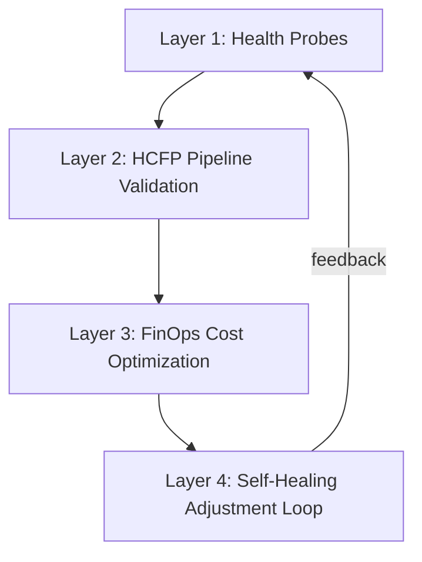
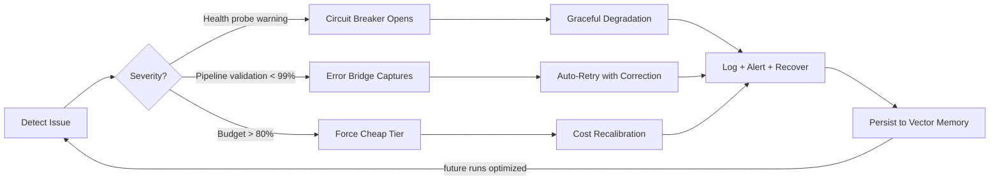

# Heady Optimization Testing & Adjustment Process

> **How the system proves optimal operating conditions and integrates adjustments when optimizations are absent**

---

## The 4-Layer Optimization Architecture



---

## Layer 1: Health Probes — Continuous Baseline Measurement

Three Kubernetes-style endpoints ([health-routes.js](file:///home/headyme/Heady/src/routes/health-routes.js)) continuously measure system health:

| Probe | Endpoint | What It Proves | Threshold |
|---|---|---|---|
| **Liveness** | `/health/live` | Process is alive, uptime tracked | Binary pass/fail |
| **Readiness** | `/health/ready` | Can serve traffic — checks resilience breakers, filesystem, memory, event loop | `>3` open breakers → degraded; heap `>450MB` → warning; event loop lag `>100ms` → warning |
| **Full Status** | `/health/full` | Comprehensive: version, env, node, platform, PID, memory, CPU, resilience summary | Full telemetry snapshot |

**How to test:**

```bash
# Live check
curl -s https://127.0.0.1:3301/health/live | jq .

# Readiness (proves all subsystems nominal)
curl -s https://127.0.0.1:3301/health/ready | jq .

# Full diagnostic
curl -s https://127.0.0.1:3301/health/full | jq .
```

**When optimization is absent:** If any check returns `degraded` or `not_ready`, the system knows it's suboptimal. The resilience module's circuit breakers automatically open to prevent cascade failures.

---

## Layer 2: HCFP Pipeline — 5-Step Deterministic Validation

The [pipeline-runner.js](file:///home/headyme/Heady/src/hcfp/pipeline-runner.js) proves execution quality through a deterministic 5-step pipeline:

```
 INGEST → DECOMPOSE → ROUTE → VALIDATE → PERSIST
```

| Step | Function | What It Proves |
|---|---|---|
| **1. INGEST** | Schema validation of task manifests | Input integrity — reject malformed work before any execution |
| **2. DECOMPOSE** | Break into atomic tasks, assign expected outcomes | Every task has a measurable success criterion |
| **3. ROUTE** | Full parallel execution via brain (all tasks fire simultaneously) | Execution speed + provider connectivity |
| **4. VALIDATE** | Score: `completed / total` → status | **The proof**: `≥99%` = validated, `≥50%` = partial, `<50%` = failed |
| **5. PERSIST** | Log to JSONL + embed into vector store | Knowledge retention — every result feeds future optimization |

**The proof metric**: Validation score. Each manifest gets a deterministic score proving what percentage of tasks succeeded. Each task gets a `sha256` audit hash proving exactly what happened.

**When optimization is absent:** If validation score drops below 99%, the manifest status becomes `partial` or `failed`. The error-pipeline-bridge ([error-pipeline-bridge.js](file:///home/headyme/Heady/src/lifecycle/error-pipeline-bridge.js)) captures failures and feeds them back for automatic correction.

---

## Layer 3: FinOps Budget Router — Cost-Optimal Routing

The [finops-budget-router.js](file:///home/headyme/Heady/src/engines/finops-budget-router.js) proves cost-efficiency through intelligent task routing:

### Complexity Scoring Algorithm

```javascript
// Heuristic scoring (1-10):
tokens > 2000  → +2    tokens > 5000  → +2
"analyze/refactor" → +1    "architecture/design" → +2
"security/audit" → +1      "simple/quick" → -2
action=think → +2           action=chat → -1
```

### 6-Tier Cost Cascade

| Tier | Provider | Cost/1k tokens | Latency | Complexity Range |
|---|---|---|---|---|
| local | Ollama (llama3.2) | $0.000 | 200ms | 1–3 |
| edge | Cloudflare (llama-3.1-8b) | $0.0001 | 50ms | 1–4 |
| fast | Groq (llama-3.3-70b) | $0.00059 | 100ms | 2–6 |
| balanced | Gemini (2.0-flash) | $0.0001 | 300ms | 3–7 |
| reasoning | Anthropic (claude-sonnet-4) | $0.003 | 800ms | 5–9 |
| frontier | OpenAI (gpt-4o) | $0.005 | 1000ms | 7–10 |

**Proof of optimization:**

- Every task provably routes to the cheapest provider capable of handling its complexity
- Budget guard: at `>80%` daily budget usage, automatically forces cheapest tier
- Every transaction is logged with provider, tokens, cost, and timestamp

**When optimization is absent:** If tasks are being routed to expensive tiers for simple work, the complexity heuristic is recalibrated. If budget is blowing out, the guard forces downshift.

---

## Layer 4: Self-Healing Adjustment Loop

When the system detects suboptimal conditions, here's the exact correction process:



### The Graceful Shutdown Protocol

[graceful-shutdown.js](file:///home/headyme/Heady/src/lifecycle/graceful-shutdown.js) ensures that even when things go wrong, the system exits cleanly:

1. **SIGTERM/SIGINT** → Flush all pending writes
2. Save state to disk before exit
3. Close database connections gracefully
4. Release file locks and network ports
5. Log final state for post-mortem analysis

---

## The Complete Testing Process

### Step 1: Prove the Baseline

```bash
# Get full system state
curl -s https://127.0.0.1:3301/health/full | jq .

# Get HCFP dashboard (ORS, decisions, arena config)
curl -s https://127.0.0.1:3301/api/hcfp/dashboard | jq .

# Get budget status
# (via FinOps router — shows remaining budget, usage %, transaction count)
```

### Step 2: Execute a Pipeline Run

```bash
# Fire a task manifest through the 5-step pipeline
curl -s -X POST https://127.0.0.1:3301/api/hcfp/auto-flow \
  -H "Content-Type: application/json" \
  -d '{"task":"test optimization","context":"validation run"}'
```

### Step 3: Validate Results

- Pipeline returns: `score`, `completed`, `failed`, `total`, `status`
- Each task carries an `audit_hash` (SHA-256) proving execution integrity
- Results are persisted to JSONL log + embedded in vector memory

### Step 4: Detect Gaps

- Score `<99%` → identify which tasks failed and why
- Error bridge captures stderr, stack traces, severity
- Health probes reveal resource pressure (memory, event loop lag, breaker state)

### Step 5: Integrate Adjustments

- **Code fixes**: Error pipeline bridge auto-ingests failures for reprocessing
- **Routing fixes**: FinOps router recalibrates complexity scoring
- **Resource fixes**: Resilience module opens/closes circuit breakers
- **Knowledge**: Vector embeddings from persisted manifests ensure the same mistake is never repeated — future pipeline runs get context from past failures

---

## Key Metrics That Prove Optimal Operations

| Metric | Source | Optimal Value |
|---|---|---|
| **ORS (Operational Readiness Score)** | HCFP dashboard | 100.0 |
| **Pipeline validation score** | pipeline-runner validate() | ≥ 99% |
| **Health readiness status** | /health/ready | `ready` |
| **Event loop lag** | /health/ready | < 100ms |
| **Heap usage** | /health/ready | < 450MB |
| **Open circuit breakers** | /health/ready | ≤ 3 |
| **Daily budget usage** | FinOps router | < 80% |
| **Task audit hashes** | pipeline-runner PERSIST | All present (zero missing) |
