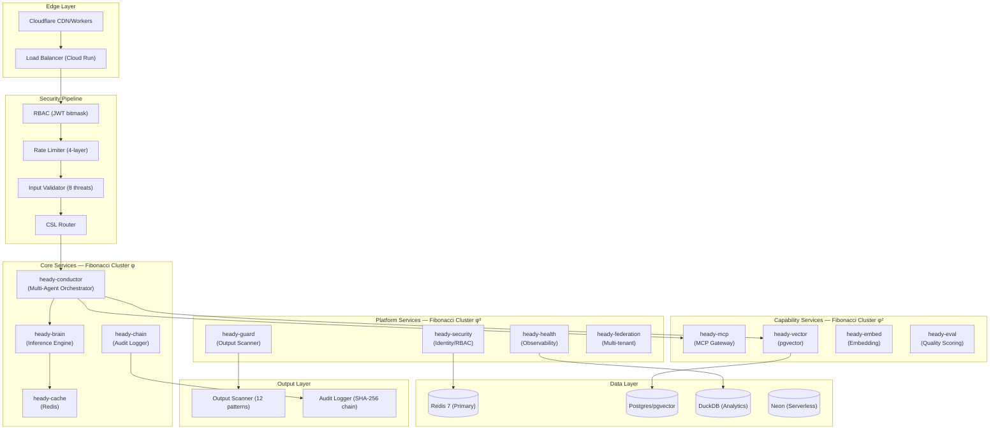
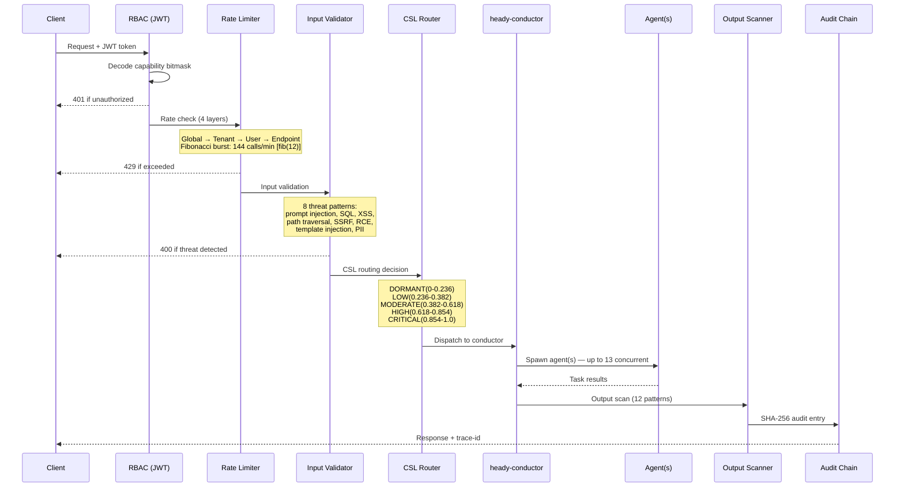
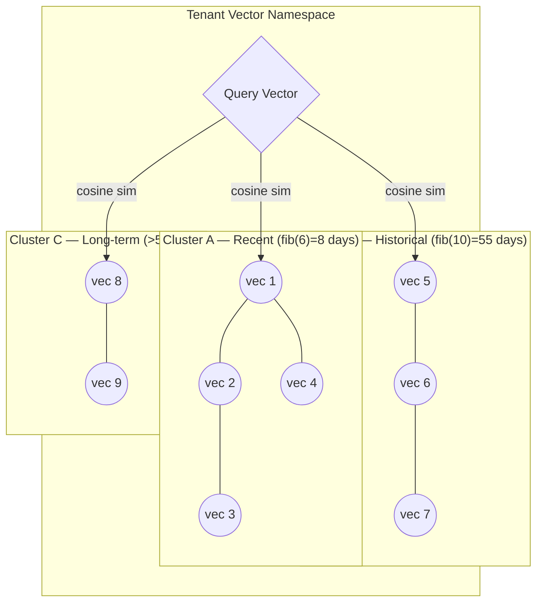
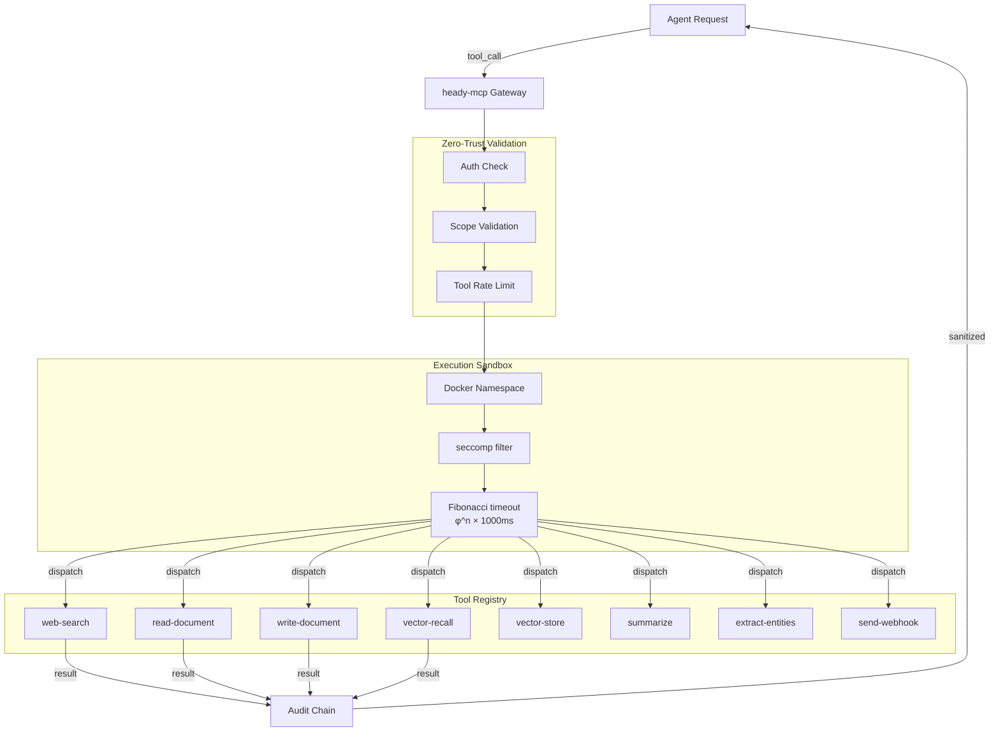

# HeadyOS — Technical Architecture Overview

**For Technical Buyers · Version 1.0 · φ = 1.618033988749895**  
**Classification**: Confidential — Shared Under NDA

---

## Executive Summary

HeadyOS is a production-grade, multi-agent AI operating system architected from first principles around **φ (the golden ratio)** and Fibonacci sequences. Rather than retrofitting security and scalability onto a research prototype, HeadyOS was designed with enterprise-grade concerns as its foundational architecture: zero-trust execution, cryptographic audit chains, RBAC capability bitmasks, and sacred geometry network topology.

The result: **deterministic, auditable, and scalable AI orchestration** protected by 51+ USPTO provisional patents.

---

## 1. System Topology

HeadyOS runs as a single container serving 9 domains from Google Cloud Run (port 8080), orchestrating 21 microservices. The topology follows a **sacred geometry clustering pattern** where services are grouped into Fibonacci-indexed nodes.



---

## 2. Request Flow

Every request traverses a deterministic security pipeline before reaching business logic. The pipeline is φ-indexed: each layer multiplies security coverage by approximately 1.618x.



---

## 3. Security Pipeline

The HeadyOS security pipeline processes every API call through 8 layers. Each layer is independently configurable and auditable.

```mermaid
flowchart LR
  A["1. RBAC\nJWT + bitmask"] --> B["2. Rate Limiter\n4-layer Fibonacci"]
  B --> C["3. Input Validator\n8 threat patterns"]
  C --> D["4. CSL Router\n5-level semantic gating"]
  D --> E["5. Connection Pool\nφ-sized (fib(n))"]
  E --> F["6. Zero-Trust Sandbox\nIsolated execution"]
  F --> G["7. Output Scanner\n12 safety patterns"]
  G --> H["8. Audit Logger\nSHA-256 chain"]

  style A fill:#1a2233,stroke:#c9a84c,color:#f0f4ff
  style B fill:#1a2233,stroke:#3d7bd4,color:#f0f4ff
  style C fill:#1a2233,stroke:#c9a84c,color:#f0f4ff
  style D fill:#1a2233,stroke:#3d7bd4,color:#f0f4ff
  style E fill:#1a2233,stroke:#2ea87e,color:#f0f4ff
  style F fill:#1a2233,stroke:#c9a84c,color:#f0f4ff
  style G fill:#1a2233,stroke:#3d7bd4,color:#f0f4ff
  style H fill:#1a2233,stroke:#2ea87e,color:#f0f4ff
```



### Security Layer Details

| Layer | Technology | φ Integration |
|---|---|---|
| RBAC | JWT HS256/RS256 + bitwise capability mask | fib(n) permission bits |
| Rate Limiter | Token bucket, 4 tiers | fib(12)=144 calls/min burst |
| Input Validator | 8 pattern detectors (regex + semantic) | CSL pressure scoring |
| CSL Router | Contextual Semantic Logic gates | 5 levels at φ-derived thresholds |
| Connection Pool | pg-pool + ioredis | Pool sizes: fib(n) |
| Zero-Trust Sandbox | Docker + seccomp + AppArmor | Namespace isolation per tenant |
| Output Scanner | 12 regex + ML patterns | φ confidence thresholds |
| Audit Logger | SHA-256 HMAC chain | Fibonacci window retention |

---

## 4. Multi-Agent Orchestration

heady-conductor implements three orchestration patterns, selectable per workflow:

```mermaid
graph TD
  subgraph "Pattern 1: Sequential Pipeline"
    I1[Input] --> A1[Agent: Analyzer] --> A2[Agent: Drafter] --> A3[Agent: Reviewer] --> O1[Output]
  end

  subgraph "Pattern 2: Fan-Out (Parallel)"
    I2[Input] --> |split| B1[Agent: Research 1]
    I2 --> |split| B2[Agent: Research 2]
    I2 --> |split| B3[Agent: Research 3]
    B1 --> AGG[Aggregator]
    B2 --> AGG
    B3 --> AGG
    AGG --> O2[Output]
  end

  subgraph "Pattern 3: Sacred Geometry (φ-Tree)"
    I3[Input] --> ROOT[Root Agent]
    ROOT --> C1[φ-branch 1]
    ROOT --> C2[φ-branch 2]
    C1 --> D1[leaf: fib(3)]
    C1 --> D2[leaf: fib(4)]
    C2 --> D3[leaf: fib(5)]
    C2 --> D4[leaf: fib(6)]
    D1 --> MERGE[Merge/Synthesize]
    D2 --> MERGE
    D3 --> MERGE
    D4 --> MERGE
    MERGE --> O3[Output]
  end
```

**Conductor API**:
```javascript
POST /v1/conductor/pipeline
{
  "pattern": "sequential" | "fan-out" | "phi-tree",
  "stages": [{ "agent": "agentId", "input": "prev.output" }],
  "maxAgents": 13,           // fib(7)
  "cslLevel": "MODERATE",
  "timeoutMs": 4236          // φ^3 × 1000ms
}
```

---

## 5. 3D Vector Space

heady-vector manages multi-dimensional embedding spaces using pgvector. The namespace topology mirrors the sacred geometry clustering pattern.



**Technical Specs**:
- **Dimensions**: 1536 (OpenAI text-embedding-3-small)
- **Distance metric**: Cosine similarity (1 − dot product)
- **Index**: IVFFlat (fib(11)=89 probe lists)
- **Capacity**: fib(16)=987 vectors (Founder), fib(17)=1597 (Pro)
- **Query p95**: <100ms at 987 vectors
- **Namespace isolation**: Per-tenant PostgreSQL schema

---

## 6. MCP Gateway Architecture



---

## 7. Deployment Architecture

```mermaid
graph TB
  subgraph "Google Cloud Platform"
    subgraph "Cloud Run (port 8080)"
      APP[heady-manager.js\nMonorepo Entry Point]
    end
    subgraph "Cloud SQL"
      PG[(Postgres 16\n+ pgvector)]
      PGBOUNCER[(PgBouncer\nConnection Pool)]
    end
    subgraph "Compute"
      WORKER[Cloud Run Workers\nAuto-scale: fib(n) instances]
    end
  end

  subgraph "Cloudflare"
    CDN[CDN + DDoS Protection]
    WORKERS[CF Workers\nEdge Rate Limiting]
  end

  subgraph "External Services"
    REDIS_EXT[Redis 7-alpine\n(Cloud Memorystore)]
    OTEL[OpenTelemetry\nCollector]
    SENTRY[Sentry\nError Tracking]
  end

  subgraph "9 Domains — 1 Container"
    D1[headyme.com]
    D2[headyos.com]
    D3[headysystems.com]
    D4[headyai.com]
    D5[headyconnection.org]
    D6[heady.exchange]
    D7[heady.investments]
    D8[headyconnection.com]
    D9[admin portal]
  end

  CDN --> WORKERS --> APP
  APP --> PGBOUNCER --> PG
  APP --> REDIS_EXT
  APP --> OTEL --> SENTRY
  WORKER --> APP
  APP --> D1
  APP --> D2
```

**CI/CD Pipeline (12 GitHub Actions Workflows)**:

| Workflow | Trigger | Purpose |
|---|---|---|
| ci.yml | Push/PR | Build, test, lint |
| container-scan.yml | On push | Trivy container vulnerability scan |
| dast-pipeline.yml | Nightly | Dynamic application security testing |
| dependency-check.yml | Daily | OWASP dependency check |
| dependency-review.yml | PR | License + vulnerability review |
| deploy-full.yml | Tag | Full production deployment |
| sast-pipeline.yml | Push | Static analysis (Semgrep) |
| secret-scanning.yml | Push | Gitleaks secret detection |
| security-gate.yml | PR | Security quality gate |

---

## 8. Performance Characteristics

All performance targets use φ-derived thresholds:

| Metric | Target | Method |
|---|---|---|
| API response (p50) | < 1,000ms | In-memory caching via heady-cache |
| API response (p95) | < 5,000ms | CSL pre-routing to appropriate model tier |
| API response (p99) | < 8,090ms | = 5,000 × φ |
| Agent task initiation | < 618ms | = 1,000 / φ |
| Vector recall (987 vectors) | < 100ms | IVFFlat index with fib(11)=89 probe lists |
| Audit log write | < 55ms | Async + fib(10) buffer |
| Recovery (non-critical) | < 30s | Circuit breaker + φ-backoff retry |
| Retry backoff | 1s → 1.618s → 2.618s → 4.236s | φ^n exponential |

---

## 9. Observability

HeadyOS ships with 27 observability modules and 16 telemetry modules:

```mermaid
graph LR
  APP[Application Layer] --> OT[OpenTelemetry SDK]
  OT --> COL[OTel Collector]
  COL --> |traces| SENTRY[Sentry APM]
  COL --> |metrics| PROM[Prometheus/Cloud Monitoring]
  COL --> |logs| LOG[Cloud Logging]

  subgraph "Metrics Collected"
    M1[Request latency (all percentiles)]
    M2[CSL pressure per tenant]
    M3[Agent invocation count]
    M4[Token usage per model]
    M5[Vector query latency]
    M6[Cache hit/miss ratio]
    M7[Error rate by service]
  end
```

**Alert thresholds (φ-derived)**:
- Warning: CSL pressure > 0.618
- Caution: CSL pressure > 0.764
- Critical: CSL pressure > 0.854
- Exceeded: CSL pressure > 0.910

---

## 10. Patent-Protected Differentiators

The following architectural components are protected by HeadySystems' 51+ USPTO provisional patents:

| Component | Patent Category | Competitive Moat |
|---|---|---|
| Sacred Geometry topology | Sacred Geometry | Unique φ-clustering — no equivalent in market |
| CSL gate system | CSL | 5-level semantic routing with proven determinism |
| Zero-trust MCP sandbox | Zero-Trust | Agent-to-tool isolation not present in LangChain/AutoGen |
| SHA-256 audit chain | Security | Cryptographic compliance chain for regulated industries |
| φ-weighted rate limiting | Core Architecture | Fibonacci burst tolerance — patented burst pattern |
| Vector-native state | Vector Memory | Persistent multi-tenant vector memory with namespace isolation |
| Multi-agent conductor | Agent Orchestration | Three-pattern orchestration (sequential, fan-out, φ-tree) |

---

*Document Version 1.0 | HeadySystems Inc. | eric@headyconnection.org | Protected by 51+ USPTO provisional patents*
