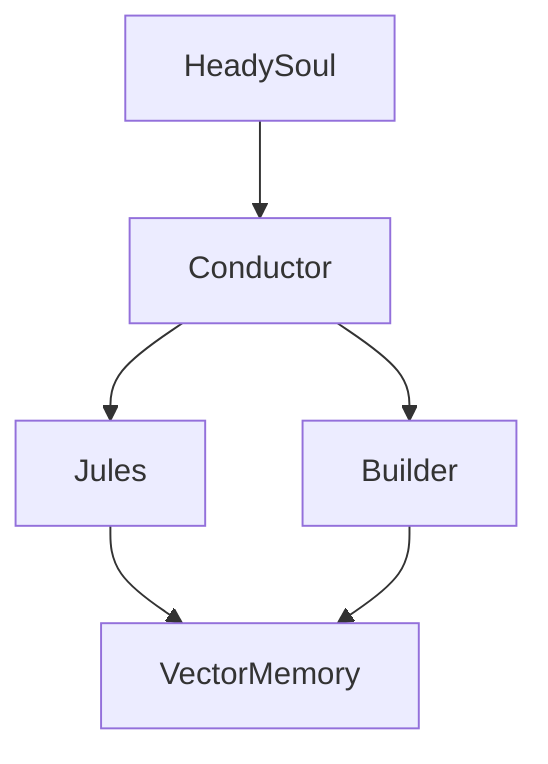

# Knowledge Cartographer for Heady

> Perplexity Computer Skill — Living maps of the Heady ecosystem

## When to Use This Skill

Use when:

- Eric asks "what's the current state of X" across the Heady ecosystem
- Mapping dependencies between services, bees, nodes, and domains
- Finding orphaned code, stale modules, or uncovered functionality
- Tracing which patent claims map to which code implementations
- Planning integration paths for new features or services
- Creating onboarding materials for collaborators or investors
- Auditing skill coverage — which ecosystem areas have skills, which don't
- Generating architecture diagrams for documentation or presentations

## Cartography Framework

### Map Types

| Map Type | Purpose | Sources |
|---|---|---|
| Service Topology | How 175 services connect | SERVICE_INDEX.json, docker-compose, imports |
| Dependency Graph | What depends on what | package.json, require/import statements |
| Sacred Geometry Layout | Node placement in topology | Node configs, zone assignments |
| Patent-to-Code Matrix | Which code implements which patent claims | Patent filings, code annotations |
| Skill Coverage Map | What areas have skills, what's uncovered | Skill library, service registry |
| Domain Routing Map | How 9 domains map to services | Cloudflare configs, gateway routes |
| Bee Registry Map | 30+ bee types and their lifecycle states | bee-factory, registry, templates |
| Data Flow Map | How data moves through the pipeline | HCFullPipeline stages, message flows |

### Phase 1: Discovery

Scan all available sources to build the raw knowledge base:

```
1. GitHub Repos (via connector or cloned workspace)
   - HeadySystems/Heady-Main (primary monorepo, 46K files)
   - HeadyMe/Heady-Main (fork with recent PRs)
   - HeadyMe/Heady-pre-production
   - HeadyMe/heady-docs

2. Workspace Files
   - SERVICE_INDEX.json — all 175 services
   - build-context.md — build context from recent sessions
   - Skills directory — all loaded and custom skills

3. Connected Apps
   - Notion (if connected) — project docs, roadmaps
   - Google Drive (if connected) — presentations, specs
   - GitHub (PRs, issues, branches)

4. Skill Library
   - All custom Heady skills in Perplexity
   - Built-in skills that apply to Heady work
```

### Phase 2: Entity Extraction

Pull structured entities from raw sources:

```
For each source, extract:
  - Services: { id, name, zone, domain, status, dependencies, healthEndpoint }
  - Bees: { type, template, lifecycle, capabilities, zone }
  - Nodes: { name, role, zone, pool, primary/fallback }
  - Domains: { url, services, routes, CDN }
  - Patents: { number, title, claims, relatedCode }
  - Skills: { name, coverage, triggers, dependencies }
  - Pipelines: { name, stages, inputs, outputs }
  - APIs: { endpoint, method, service, auth }
```

### Phase 3: Relationship Mapping

Connect entities into a graph:

```
Relationship Types:
  - DEPENDS_ON: Service A imports/calls Service B
  - ROUTES_TO: Domain routes traffic to service
  - IMPLEMENTS: Code implements patent claim
  - COVERS: Skill covers ecosystem area
  - CONTAINS: Service contains bee workers
  - FLOWS_THROUGH: Data flows through pipeline stage
  - MONITORS: Governance service monitors target
  - HEALS: Self-healing cycle targets service

Build adjacency lists and detect:
  - Orphans: Entities with no incoming connections
  - Bottlenecks: Entities with high in-degree (many depend on them)
  - Gaps: Expected connections that don't exist
  - Cycles: Circular dependencies
  - Dead ends: Services that exist but nothing routes to them
```

### Phase 4: Map Generation

Produce navigable outputs:

```
Text-Based Maps:
  - ASCII topology diagrams
  - Markdown tables with sorted entities
  - Mermaid diagram syntax for rendering

Data Files:
  - JSON adjacency lists (for programmatic use)
  - CSV entity registries (for spreadsheet analysis)
  - DOT format (for Graphviz rendering)

Narrative Maps:
  - Prose descriptions of how subsystems connect
  - Gap analysis reports
  - Onboarding walkthroughs
```

## Instructions

### Quick Audit Protocol

When Eric asks "what's the state of X":

1. Identify which map type is relevant
2. Pull data from available sources (GitHub connector, workspace files, web)
3. Extract entities related to the query
4. Map relationships
5. Identify gaps, orphans, and health issues
6. Deliver as a structured table or diagram

### Full Ecosystem Cartography

For comprehensive mapping:

1. Clone/access the monorepo
2. Parse SERVICE_INDEX.json for the full service list
3. Scan imports/requires for dependency extraction
4. Cross-reference with Sacred Geometry topology (Center → Inner → Middle → Outer → Governance)
5. Map each service to its domain(s)
6. Identify which services have health endpoints
7. Check which areas have skill coverage
8. Produce a multi-layer map with:
   - Layer 1: Infrastructure (Cloud Run, Cloudflare, Colab)
   - Layer 2: Services (175 services by zone)
   - Layer 3: Agents (30+ bee types, swarm topology)
   - Layer 4: Domains (9 domains, routing)
   - Layer 5: Intelligence (skills, patents, knowledge)

### Patent-to-Code Traceability

For IP audit and patent preparation:

1. List all 60+ provisional patent claims
2. For each claim, search codebase for implementing modules
3. Rate coverage: fully implemented, partially implemented, spec only
4. Identify code that implements novel methods but lacks patent coverage
5. Produce a traceability matrix

### Gap Detection

Systematically find what's missing:

```
Service Gaps:
  - Services defined in SERVICE_INDEX.json but missing code
  - Services with code but no health endpoint
  - Services not wired into the gateway

Skill Gaps:
  - Ecosystem areas with no corresponding skill
  - Skills that reference services that don't exist yet

Integration Gaps:
  - Services not reachable from any domain
  - Bees defined but not registered in factory
  - Pipeline stages referencing non-existent nodes
```

## Output Templates

### Topology Table
```
| Zone | Service | Domain | Health | Dependencies | Skill Coverage |
|---|---|---|---|---|---|
| Center | HeadySoul | headyme.com | /health ✓ | — | heady-alive-software |
| Inner | Conductor | headysystems.com | /health ✓ | Soul, Brains | heady-conductor |
...
```

### Dependency Graph (Mermaid)


### Gap Report
```
## Ecosystem Gap Analysis — [Date]

### Critical Gaps (no implementation)
1. [Service X] — defined but no code
2. [Patent Y claim 3] — no implementing code

### Coverage Gaps (partial)
1. [Service Z] — exists but no health endpoint
2. [Skill W] — covers area but outdated

### Recommendations
1. Priority 1: Wire [Service X] into gateway
2. Priority 2: Add health endpoint to [Service Z]
```
