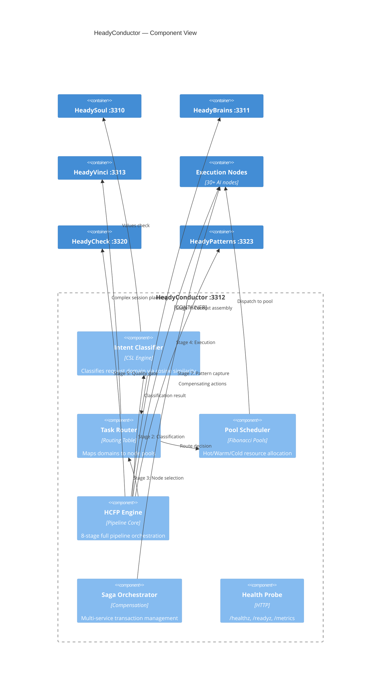

# C4 Component Diagram — HeadyConductor

## Component Descriptions

- **Intent Classifier**: Uses CSL cosine similarity to measure request vectors against domain gate vectors. Threshold levels: CRITICAL (0.927), HIGH (0.882), MEDIUM (0.809), LOW (0.691), MINIMUM (0.500).
- **Task Router**: Maintains a routing table mapping classified domains to node pools. Supports concurrent-equals routing where multiple nodes can handle the same domain.
- **Pool Scheduler**: Allocates requests to Hot (34%), Warm (21%), Cold (13%), Reserve (8%) pools based on urgency and resource availability.
- **HCFP Engine**: Orchestrates the 8-stage HCFullPipeline from context assembly through pattern capture.
- **Saga Orchestrator**: Manages distributed transactions with compensating actions for rollback.
- **Health Probe**: Exposes Kubernetes-compatible health endpoints with circuit breaker state and coherence metrics.
