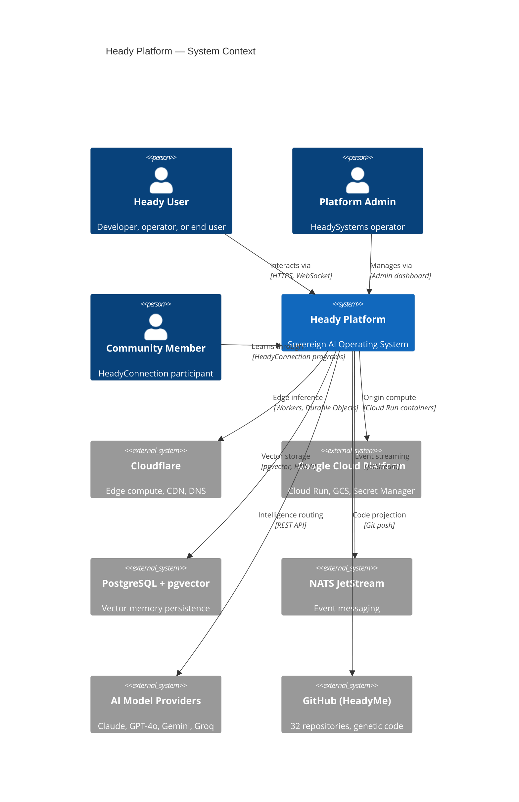

# C4 System Context Diagram — Heady Platform

## Description

The Heady Platform operates as a sovereign AI operating system that processes user requests through a multi-layered architecture spanning Cloudflare's global edge network and Google Cloud Platform's origin compute. All state is persisted in PostgreSQL with pgvector for 384-dimensional vector memory. Inter-service communication flows through NATS JetStream for event-driven patterns. AI intelligence is routed to optimal model providers through the CSL-based Mixture-of-Experts router. The GitHub monorepo serves as the immutable genetic code from which all deployed services are projected.
